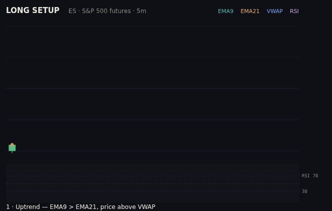

# Trading Toolkit

A set of self-contained, single-file HTML tools for learning and practicing a
**confluence-based futures trading method** (Fibonacci golden pocket + support/
resistance + candle reading) across oil (CL/MCL), the S&P 500 (ES/MES), and
Bitcoin (BTC/MBT).

These are **standalone HTML files**, not Claude Code skills — they live outside
`skills/` on purpose and are not registered in `.claude-plugin/plugin.json`.
Open any of them directly in a browser; there are no dependencies or build step.

## The tools

| File | What it does |
|------|--------------|
| [`fib-playbook.html`](fib-playbook.html) | The method end-to-end: reading candles, mapping support & all-time highs, drawing Fibonacci retracements, using indicators (VWAP / EMA / RSI), a confluence checklist, and a **position-size calculator** with real CME tick values for all six contracts. |
| [`tradingview-setup.html`](tradingview-setup.html) | A do-it-in-order TradingView setup guide: exact ticker symbols, the four indicators to load, best trading hours per market, and a daily routine. |
| [`trade-replay.html`](trade-replay.html) | An animated replay — press play and watch the same setup **win (+5R)** or **lose (−1R)** on any market, with live entry/stop/target and R-multiple. |
| [`setup-trainer.html`](setup-trainer.html) | A practice drill: get dealt randomized setups, decide **Take** or **Pass**, and get scored on the *decision* (not the outcome), with per-market accuracy tracking. |
| [`trade-journal.html`](trade-journal.html) | Log trades and auto-compute P&L, R-multiple, win rate, expectancy, profit factor, an equity curve, and a **per-market breakdown**. Saves in the browser; exports CSV. |

The trainer and journal persist data in the browser's `localStorage`, so use the
journal's **Export CSV** for backups.

## End-to-end demos

The same setup — uptrend (EMA 9/21 + VWAP), pullback into the 0.618 golden
pocket, a hammer rejection at the level, then entry with a defined stop and
target — playing out to both outcomes. Indicators, the pocket highlight, the
hammer glow, the entry/stop/target draw-in, and an RSI panel are all shown.

**Winner (+5R):**

**Stopped out (−1R):**

The two look identical at the entry — you can't tell them apart in advance.
That's the point: the edge is a small, pre-planned stop and letting winners run,
not prediction.

## How they fit together

1. **Playbook** — learn the method and how to size a trade.
2. **TradingView Setup** — get the markets and indicators on screen (free).
3. **Trade Replay** — see what a winning *and* losing setup looks like.
4. **Setup Trainer** — drill recognizing the setup until it's automatic.
5. **Journal** — record real paper trades and find out if you actually have an edge.

## Honest disclaimer

This is **education, not financial advice**. Nothing here predicts markets — no
indicator, strategy, or tool can. Futures trading carries substantial risk of
loss; you can lose more than you deposit. The replays and trainer use idealized
or generated setups to teach pattern recognition and are cleaner than real
markets. Practice on a **free simulator / paper account** until a real journal
shows positive expectancy over many trades before risking money, and start on
the micro contracts (MCL/MES/MBT) where a mistake costs a few dollars.
