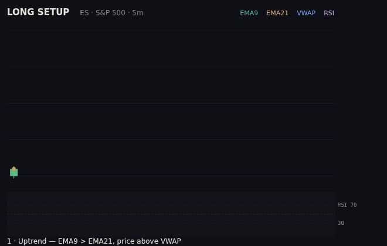
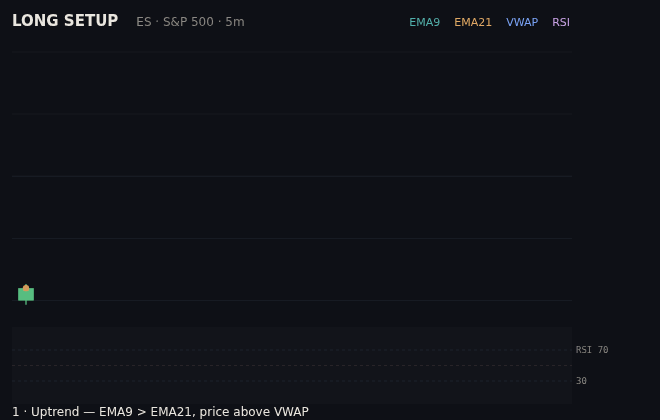
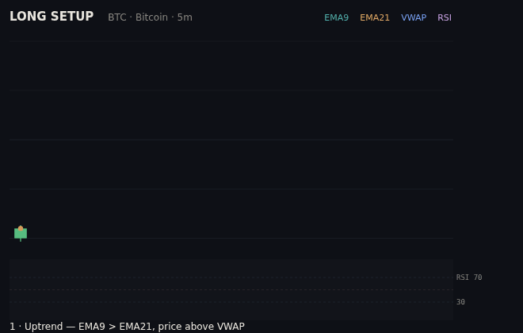

# Trading Toolkit

A set of self-contained, single-file HTML tools for learning and practicing a
**confluence-based futures trading method** (Fibonacci golden pocket + support/
resistance + candle reading) across oil (CL/MCL), the S&P 500 (ES/MES), and
Bitcoin (BTC/MBT).

These are **standalone HTML files**, not Claude Code skills — they live outside
`skills/` on purpose and are not registered in `.claude-plugin/plugin.json`.
Open any of them directly in a browser; there are no dependencies or build step.

## The tools

| File | What it does |
|------|--------------|
| [`fib-playbook.html`](fib-playbook.html) | The method end-to-end: reading candles, mapping support & all-time highs, drawing Fibonacci retracements, using indicators (VWAP / EMA / RSI), a confluence checklist, and a **position-size calculator** with real CME tick values for all six contracts. |
| [`tradingview-setup.html`](tradingview-setup.html) | A do-it-in-order TradingView setup guide: exact ticker symbols, the four indicators to load, best trading hours per market, and a daily routine. |
| [`trade-replay.html`](trade-replay.html) | An animated replay — press play and watch the same setup **win (+5R)** or **lose (−1R)** on any market, with live entry/stop/target and R-multiple. |
| [`setup-trainer.html`](setup-trainer.html) | A practice drill: get dealt randomized setups, decide **Take** or **Pass**, and get scored on the *decision* (not the outcome), with per-market accuracy tracking. |
| [`trade-journal.html`](trade-journal.html) | Log trades and auto-compute P&L, R-multiple, win rate, expectancy, profit factor, an equity curve, and a **per-market breakdown**. Saves in the browser; exports CSV. |
| [`strategy-lab.html`](strategy-lab.html) | A **programmable rule backtester**: define entry triggers (trend / Fibonacci golden zone / candle pattern / RSI) and a profit-target + stop exit, then run it over any market's candles — built-in samples or **pasted CSV** (e.g. a TradingView export). Reports win rate, expectancy, profit factor, max drawdown, and an equity curve in **R**, with a plain-English edge verdict. Every rule set serializes to reusable JSON. |
| [`auto-optimizer.html`](auto-optimizer.html) | A **self-searching optimizer** ("machine learning, the honest kind"): it tries hundreds of rule combinations, learns the best on a training slice, then tests that winner on data it never saw. The in-sample vs **out-of-sample** gap exposes overfitting — most "winners" collapse on unseen data, and the tool says so. |
| [`live-recorder.html`](live-recorder.html) ⚠️ *run locally* | **Records real market candles** from a live, keyless crypto feed (BTC / ETH / SOL via Coinbase), charts them live, and **exports CSV** to feed the Strategy Lab and Auto-Optimizer. Must be **opened as a local file** — hosted sandboxes block live network access. |

For a **24/7, always-on** version that records candles and re-runs the backtest in
the cloud on a schedule (no browser, no tokens, paper only), see
[`server/`](server/) — a ready-to-deploy [Val Town](https://val.town) project
(cron recorder + live dashboard).

The trainer, journal, and recorder persist data in the browser's `localStorage`,
so use **Export CSV** for backups. The Strategy Lab and Auto-Optimizer accept real
historical candles via CSV paste, so you can backtest your actual market and
timeframe — including candles captured with the Live Recorder.

### A note on `live-recorder.html`

Unlike the other tools, the recorder makes live network requests, so a hosted
artifact's security policy (CSP) blocks it. **Open the file directly in a
browser** (double-click it) or serve it locally. It records **crypto** only —
Bitcoin/ETH/SOL have free real-time feeds, whereas oil and S&P *futures* data
requires a paid CME subscription.

## End-to-end demos

The same setup — uptrend (EMA 9/21 + VWAP), pullback into the 0.618 golden
pocket, a hammer rejection at the level, then entry with a defined stop and
target — playing out to both outcomes on every market, with real price levels.
Indicators, the pocket highlight, the hammer glow, the entry/stop/target
draw-in, and an RSI panel are all shown.

Within each market, the winner and the loser share an **identical entry** — you
can't tell them apart in advance. That's the point: the edge is a small,
pre-planned stop and letting winners run, not prediction. Notice the geometry is
the same across oil, the S&P, and Bitcoin — one method, every market — only the
price scale changes.

### Oil — CL / MCL

| Winner (+5R) | Stopped out (−1R) |
|---|---|
|  |  |

### S&P 500 — ES / MES

| Winner (+5R) | Stopped out (−1R) |
|---|---|
|  |  |

### Bitcoin — BTC / MBT

| Winner (+5R) | Stopped out (−1R) |
|---|---|
|  |  |

## How they fit together

1. **Playbook** — learn the method and how to size a trade.
2. **TradingView Setup** — get the markets and indicators on screen (free).
3. **Trade Replay** — see what a winning *and* losing setup looks like.
4. **Setup Trainer** — drill recognizing the setup until it's automatic.
5. **Live Recorder** — capture real candles from a live feed (run locally) to test on.
6. **Strategy Lab** — turn a rule idea into evidence: backtest it on real candles before risking anything.
7. **Auto-Optimizer** — let it search the rule space, then check whether the winner survives out-of-sample.
8. **Journal** — record real paper trades and find out if you actually have an edge.

## Honest disclaimer

This is **education, not financial advice**. Nothing here predicts markets — no
indicator, strategy, or tool can. Futures trading carries substantial risk of
loss; you can lose more than you deposit. The replays and trainer use idealized
or generated setups to teach pattern recognition and are cleaner than real
markets. Practice on a **free simulator / paper account** until a real journal
shows positive expectancy over many trades before risking money, and start on
the micro contracts (MCL/MES/MBT) where a mistake costs a few dollars.
